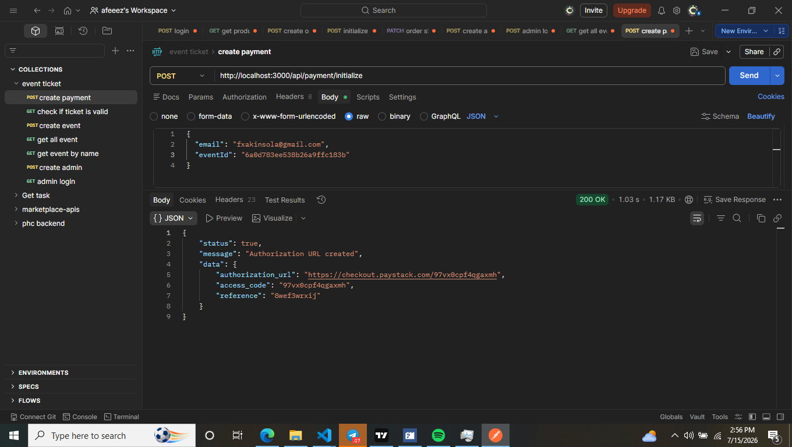

# Event Ticket API

A production-ready RESTful API for an Event Ticket Booking System built with Node.js, Express.js, MongoDB, and Paystack.

The API allows users to browse available events, purchase tickets securely through Paystack, receive ticket confirmation emails with QR codes, and verify tickets in real time. Event management is restricted to authenticated administrators.

---

## Features

### Authentication

- Admin Registration
- Admin Login
- JWT Authentication
- Protected Admin Routes

### Event Management

- Create Event (Admin Only)
- Update Event (Admin Only)
- Delete Event (Admin Only)
- Get All Events
- Search Events by Name
- Pagination Support

### Payment Processing

- Paystack Payment Integration
- Secure Webhook Verification
- Metadata Handling
- Webhook Idempotency to prevent duplicate ticket creation

### Ticket Management

- Automatic Ticket Generation
- Unique Ticket IDs
- QR Code Generation
- Ticket Verification
- Duplicate Ticket Prevention

### Email Notifications

- HTML Email Templates
- Ticket Confirmation Emails
- QR Code Attachment

### Security

- JWT Authentication
- Helmet Security Headers
- Rate Limiting
- Joi Request Validation
- Environment Variable Protection
- Paystack Webhook Signature Verification

### Monitoring

- Morgan Request Logging
- Winston Application Logging
- Prometheus Metrics

---

## Tech Stack

- Node.js
- Express.js
- MongoDB & Mongoose
- JWT
- Paystack API
- Nodemailer
- QRCode
- Joi
- Helmet
- Morgan
- Winston
- Prometheus Client
- Swagger UI

---

## API Documentation

Swagger Documentation

```
https://event-ticket-api.onrender.com/api-docs
```

---

## Base URL

Production

```
https://event-ticket-api.onrender.com
```

Local

```
http://localhost:3000
```

---

## API Endpoints

### Authentication

| Method | Endpoint             | Description       |
| ------ | -------------------- | ----------------- |
| POST   | `/api/auth/register` | Register an Admin |
| POST   | `/api/auth/login`    | Login an Admin    |

### Events

| Method | Endpoint          | Description              |
| ------ | ----------------- | ------------------------ |
| GET    | `/api/events`     | Get All Events           |
| POST   | `/api/events`     | Create Event (Protected) |
| PUT    | `/api/events/:id` | Update Event (Protected) |
| DELETE | `/api/events/:id` | Delete Event (Protected) |

### Payments

| Method | Endpoint                  | Description        |
| ------ | ------------------------- | ------------------ |
| POST   | `/api/payment/initialize` | Initialize Payment |
| POST   | `/api/payment/webhook`    | Paystack Webhook   |

### Tickets

| Method | Endpoint                        | Description   |
| ------ | ------------------------------- | ------------- |
| GET    | `/api/tickets/verify/:ticketId` | Verify Ticket |

---

## Security Features

- JWT Authentication
- Protected Admin Routes
- API Rate Limiting
- Joi Request Validation
- Helmet Security Headers
- Secure Webhook Verification
- Webhook Idempotency
- Environment Variable Protection

---

## Installation

Clone the repository

```bash
git clone https://github.com/Harfies/event-ticket-api.git
```

Navigate into the project

```bash
cd event-ticket-api
```

Install dependencies

```bash
npm install
```

Create a `.env` file and configure the required environment variables.

Run the application

Development

```bash
npm run dev
```

Production

```bash
npm start
```

---

## Screenshots

### Swagger Documentation

### Postman Testing

### Register

- Admin Registration
  ![Register] (images/create-admin.png)

### Login

- Admin Login
  ![Login] (images/login_admin.png)

### Create Event

- Create Event
  ![Create_Event] (images/create_event.png)

### Get Events

- Get Events
  ![Get_Events] (images/get_all_event.png)

### Get Event By Name

- Get Event By Name
  ![Get_Event_By_Name] (images/get_event_by_name.png)

### Pay For Event

- Initialize Payment
  

## Deployment

Hosted on Render.

Deployment Steps

1. Push the project to GitHub.
2. Connect the repository to Render.
3. Configure the required environment variables.
4. Deploy the application.

---

## Future Improvements

- Redis Caching
- BullMQ Background Jobs
- Docker Support
- MongoDB Sanitization
- Metrics & Tracing
- Role-Based Access Control (RBAC)
- Admin Dashboard
- Analytics Dashboard

---

## Author

**Afeez Akinsola**

GitHub: https://github.com/Harfies

Email: akinsolaafeez82@gmail.com

---

## License

MIT License
